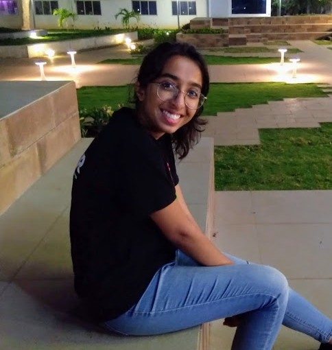

## Hello, I'm Deepti Hegde

I'm a first year PhD student in ECE at Johns Hopkins University guided by Dr. Vishal Patel. I am interested in 3D scene unserstanding and representation learning. 
&nbsp

### *News*

- I will be presenting my undergrad thesis work on single underwater image restoration at WiCV workshop at ECCV 2020.
- I have joined the VIU lab at Johns Hopkins!

